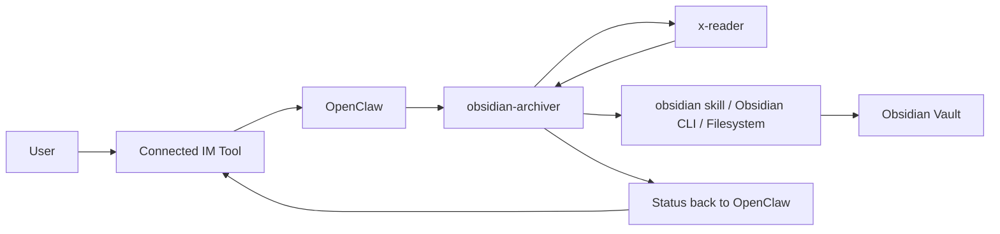

# Obsidian Archiver

Obsidian Archiver is an orchestration skill for a local OpenClaw workflow.

Obsidian Archiver 是一个面向本地 OpenClaw 工作流的编排型 skill。

Its intended chain is:

1. A user sends a command from any IM tool already connected to OpenClaw.
2. OpenClaw receives the task.
3. OpenClaw calls this skill.
4. This skill calls x-reader to extract content and metadata.
5. This skill organizes the result into a clean Markdown note.
6. This skill reuses the local Obsidian note-writing workflow to save the note into the vault.

目标调用链是：

1. 用户从任意一个已经接入 OpenClaw 的 IM 工具发出命令。
2. OpenClaw 接收到任务。
3. OpenClaw 调用这个 skill。
4. 这个 skill 调用 x-reader 提取正文和元数据。
5. 这个 skill 将结果整理成干净的 Markdown 笔记。
6. 这个 skill 复用本地 Obsidian 写入流程，把笔记保存到 vault。

## Architecture



## Purpose

This skill is not a replacement for x-reader or Obsidian integration.

It exists to connect the three layers:
- OpenClaw for orchestration
- x-reader for extraction
- Obsidian for storage

这个 skill 不是用来替代 x-reader 或 Obsidian 集成层的。

它的作用是连接三层能力：
- OpenClaw：负责编排
- x-reader：负责提取
- Obsidian：负责存储

## Dependencies

Required before deploying this skill:
- OpenClaw already running locally and connected to at least one IM tool
- x-reader already installed, deployed, or otherwise reachable from OpenClaw
- a reachable Obsidian vault

Recommended:
- the existing `obsidian` skill available in the same skill environment
- the official `obsidian` CLI configured locally if your write path depends on it

部署这个 skill 之前，至少需要：
- OpenClaw 已在本地运行，并连接至少一个 IM 工具
- x-reader 已经安装、部署，或可被 OpenClaw 访问
- Obsidian vault 可从本地环境访问

推荐另外准备：
- 同一 skill 环境中已有 `obsidian` skill
- 如果你的写入链路依赖官方 CLI，则本地已经配置好 `obsidian` CLI

## Repository layout

- `SKILL.md`: agent-facing orchestration instructions
- `agents/openai.yaml`: UI-facing metadata and default prompt
- `references/category-rules.md`: default folder, title, and tag heuristics
- `references/local-config.example.json`: local configuration example for x-reader and vault settings
- `scripts/run_archiver.ps1`: minimal wrapper that standardizes local execution

目录结构说明：
- `SKILL.md`：给代理看的编排说明
- `agents/openai.yaml`：给 UI / 调用层看的元数据和默认提示
- `references/category-rules.md`：默认的分类、标题和标签规则
- `references/local-config.example.json`：x-reader 与 vault 的本地配置样例
- `scripts/run_archiver.ps1`：标准化本地执行方式的最小包装器

## What the wrapper does

`scripts/run_archiver.ps1` is a lightweight local entrypoint.

It is designed to:
- accept a URL, file path, or raw text
- load local settings from a JSON config file
- normalize the incoming payload for x-reader
- call x-reader in a consistent way when configured
- build a Markdown note payload
- optionally write the note directly into the Obsidian vault when `obsidian.mode` is `filesystem`
- return a JSON result that OpenClaw can consume

`run_archiver.ps1` 是一个轻量级本地入口。

它的作用是：
- 接收 URL、文件路径或原始文本
- 从 JSON 配置文件中读取本地设置
- 把输入标准化为 x-reader 可处理的载荷
- 在配置完成时，用统一方式调用 x-reader
- 生成 Markdown 笔记内容
- 当 `obsidian.mode` 为 `filesystem` 时，直接写入 Obsidian vault
- 输出 JSON 结果给 OpenClaw 消费

## What the local config does

`references/local-config.example.json` separates environment-specific values from the workflow logic.

Use it to define:
- how x-reader is called
- which arguments are passed
- where the Obsidian vault is
- which default folder/tag should be used
- whether filenames should be prefixed with the capture date

`references/local-config.example.json` 用来把“环境差异”从工作流逻辑里拆出来。

它负责定义：
- x-reader 应该如何被调用
- 需要传哪些参数
- Obsidian vault 在哪里
- 默认归档到哪个文件夹、打什么默认标签
- 文件名是否需要加日期前缀

## Recommended deployment order

1. Deploy and verify OpenClaw.
2. Connect and verify your IM channel.
3. Deploy and verify x-reader.
4. Adjust `references/local-config.example.json` for your environment.
5. Test `scripts/run_archiver.ps1` with `-DryRun`.
6. Verify how Obsidian notes are created in your environment.
7. Deploy `obsidian-archiver`.
8. Test the full chain from IM to OpenClaw to x-reader to Obsidian.

推荐部署顺序：

1. 先部署并验证 OpenClaw。
2. 再连接并验证你的 IM 渠道。
3. 部署并验证 x-reader。
4. 按你的本地环境调整 `references/local-config.example.json`。
5. 先用 `-DryRun` 测试 `scripts/run_archiver.ps1`。
6. 确认 Obsidian 的写入方式已经打通。
7. 部署 `obsidian-archiver`。
8. 做一轮从 IM 到 OpenClaw 再到 x-reader 和 Obsidian 的端到端测试。

## Quick example

```powershell
powershell -ExecutionPolicy Bypass -File .\scripts\run_archiver.ps1 -SourceUrl "https://example.com" -DryRun
```

```powershell
powershell -ExecutionPolicy Bypass -File .\scripts\run_archiver.ps1 -SourcePath "C:\docs\sample.pdf" -ConfigPath .\references\local-config.example.json
```

## Implementation status

Current implementation covers:
- workflow role definition
- dependency boundaries
- x-reader handoff expectations
- classification and note structure rules
- Obsidian storage handoff strategy
- a minimal PowerShell wrapper
- a local config example
- deployment guidance

Current implementation does not yet include:
- a concrete OpenClaw adapter or webhook handler
- a vault-specific category mapping file
- a production-tested x-reader argument contract

当前已经完成：
- 工作流角色定义
- 依赖边界划分
- x-reader 调用预期
- 分类和笔记结构规则
- Obsidian 存储交接策略
- 一个最小可用的 PowerShell 包装器
- 一个本地配置样例
- 部署说明

当前还没有内置：
- OpenClaw 专用适配器或 webhook 处理器
- vault 专属分类映射文件
- 经过生产验证的 x-reader 参数契约
