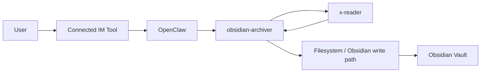
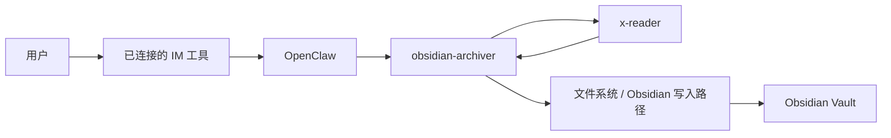

# Obsidian Archiver

## English

### Overview

Obsidian Archiver is a local orchestration skill for OpenClaw.
It sits between OpenClaw, x-reader, and Obsidian:
- OpenClaw receives the user task
- `obsidian-archiver` normalizes the input and calls x-reader
- x-reader extracts the source content
- `obsidian-archiver` builds a Markdown note and writes it into an Obsidian vault

### Architecture



### What This Repository Includes

Required files for deployment:
- `SKILL.md`: agent-facing orchestration instructions
- `agents/openai.yaml`: UI-facing metadata and default prompt
- `references/category-rules.md`: default classification heuristics
- `references/local-config.example.json`: local config template
- `scripts/run_archiver.ps1`: main local entrypoint
- `scripts/invoke_x_reader.ps1`: adapter that translates the archiver JSON payload into an x-reader call

This repository does not vendor x-reader itself.
Anyone deploying this skill must install x-reader separately on the target machine.

### Prerequisites

Before using this skill, make sure the target machine has:
- OpenClaw already running locally
- at least one IM channel connected to OpenClaw
- Python available in `PATH`
- a reachable Obsidian vault path
- permission to run PowerShell scripts locally
- x-reader installed separately

### Install x-reader

x-reader is an external dependency.
Install it yourself on the deployment machine.

Reference repository:
- [x-reader](https://github.com/runesleo/x-reader)

One workable install method is:

```powershell
pip install git+https://github.com/runesleo/x-reader.git
```

After installation, verify your machine can run it in some form.
For example, if you install it into the default Python environment:

```powershell
python -m x_reader.cli "https://example.com"
```

If your environment uses a virtualenv, uv, conda, Scoop Python, or another launcher, adapt the command accordingly.
The key requirement is that this skill can call x-reader from PowerShell on that machine.

### Configure Local Settings

1. Copy `references/local-config.example.json` to `references/local-config.json`.
2. Edit the copied file for your machine.
3. Do not commit `local-config.json`; it is machine-specific.

Recommended fields to adjust:
- `x_reader.command`: the executable used to launch PowerShell on the target machine
- `x_reader.args`: the absolute path to `scripts/invoke_x_reader.ps1`
- `obsidian.vault_path`: your real Obsidian vault path
- `archiver.default_folder`: default folder inside the vault
- `archiver.default_tag`: fallback tag for captured notes

Example:

```json
{
  "x_reader": {
    "mode": "command",
    "command": "powershell",
    "args": [
      "-ExecutionPolicy",
      "Bypass",
      "-File",
      "E:/path/to/obsidian-skillkit/obsidian-archiver/scripts/invoke_x_reader.ps1",
      "-InputJson",
      "{input_json}",
      "-OutputJson",
      "{output_json}"
    ]
  },
  "obsidian": {
    "mode": "filesystem",
    "vault_path": "E:/path/to/your/ObsidianVault"
  },
  "archiver": {
    "default_folder": "Inbox",
    "default_tag": "captured",
    "prefix_date": true
  }
}
```

### How `run_archiver.ps1` Works

`scripts/run_archiver.ps1`:
- accepts `-SourceUrl`, `-SourcePath`, or `-RawText`
- loads `references/local-config.json` if present, otherwise falls back to the example config
- writes a normalized request payload
- calls `scripts/invoke_x_reader.ps1`
- builds a Markdown note
- optionally writes the note into the configured vault
- returns JSON that OpenClaw can consume

`scripts/invoke_x_reader.ps1` is the compatibility layer between this skill and x-reader.
It is responsible for:
- reading the temporary input JSON
- calling x-reader in a consistent way
- mapping the extraction result back into the note format expected by `run_archiver.ps1`

### Current Input Support

Recommended production path today:
- `SourceUrl`

Current implementation is optimized for URL ingestion because x-reader's current CLI is URL-first.
`run_archiver.ps1` still accepts `-SourcePath` and `-RawText`, but this repository does not yet ship a full non-URL extraction backend for those inputs.
If you need file-path or raw-text ingestion, add an extra extractor or fallback path in your local deployment.

### Deployment Steps

1. Deploy OpenClaw and make sure it can receive commands.
2. Install x-reader on the same machine or on a locally reachable execution environment.
3. Copy `references/local-config.example.json` to `references/local-config.json`.
4. Replace the placeholder script path and vault path in `local-config.json`.
5. Verify x-reader itself works on the machine.
6. Run `scripts/run_archiver.ps1` manually.
7. Wire OpenClaw to call this skill.
8. Test the full chain from IM to OpenClaw to x-reader to Obsidian.

### Manual Test Commands

URL dry run:

```powershell
powershell -ExecutionPolicy Bypass -File .\scripts\run_archiver.ps1 -SourceUrl "https://example.com" -DryRun
```

URL end-to-end test writing into a vault:

```powershell
powershell -ExecutionPolicy Bypass -File .\scripts\run_archiver.ps1 -SourceUrl "https://example.com" -VaultPath "E:\Obsidian\MyVault"
```

Explicit config path:

```powershell
powershell -ExecutionPolicy Bypass -File .\scripts\run_archiver.ps1 -SourceUrl "https://example.com" -ConfigPath .\references\local-config.json
```

### OpenClaw Integration Expectation

When OpenClaw invokes this skill, it should provide at least one of:
- a URL
- a local source path
- raw text

If OpenClaw already knows the target vault, it can pass the vault path at runtime.
That means you do not have to hardcode the vault path in `local-config.json` if your OpenClaw workflow always supplies it.

### What Should Be Committed

Commit these files:
- the skill files in this repository
- `references/local-config.example.json`
- documentation and scripts needed for deployment

Do not commit:
- `references/local-config.json`
- `.x-reader-site/`
- `.venv/`
- `.tmp/`
- `obsidian-archiver/.tmp/`
- `obsidian-archiver/.x-reader-runtime/`
- test vault contents
- inbox and log files

### Thanks

Thanks to the main projects this skill depends on:
- [Obsidian](https://obsidian.md/) for the vault-based workflow and ecosystem
- [x-reader](https://github.com/runesleo/x-reader) for the extraction layer
- OpenClaw for the orchestration context this skill is designed for

### Summary

If someone only reads this repository, the deployment model should be:
- install x-reader yourself
- copy and edit `local-config.example.json`
- point the config to your local `invoke_x_reader.ps1`
- set your real Obsidian vault path or pass it at runtime
- run `scripts/run_archiver.ps1`
- then connect the same command path to OpenClaw

## 中文

### 说明

Obsidian Archiver 是一个面向本地 OpenClaw 工作流的编排型 skill。
它工作在 OpenClaw、x-reader 和 Obsidian 之间：
- OpenClaw 接收用户任务
- `obsidian-archiver` 标准化输入并调用 x-reader
- x-reader 提取正文与元数据
- `obsidian-archiver` 生成 Markdown 笔记并写入 Obsidian vault

### 架构



### 仓库内包含的内容

部署所需文件：
- `SKILL.md`：给代理使用的编排说明
- `agents/openai.yaml`：给 UI 和调用层使用的元数据
- `references/category-rules.md`：默认分类规则参考
- `references/local-config.example.json`：本地配置样例
- `scripts/run_archiver.ps1`：主入口脚本
- `scripts/invoke_x_reader.ps1`：把归档器请求转换成 x-reader 调用的适配脚本

这个仓库不内置 x-reader。
任何部署者都需要在目标机器上自行安装 x-reader。

### 前置依赖

在使用这个 skill 之前，请确保目标机器具备：
- 已经运行的 OpenClaw
- 已经连接到 OpenClaw 的至少一个 IM 渠道
- `PATH` 中可用的 Python
- 可访问的 Obsidian vault 路径
- 可执行本地 PowerShell 脚本的权限
- 单独安装好的 x-reader

### 安装 x-reader

x-reader 是外部依赖，需要由部署者自行安装。

参考仓库：
- [x-reader](https://github.com/runesleo/x-reader)

一种可行的安装方式是：

```powershell
pip install git+https://github.com/runesleo/x-reader.git
```

安装后，请先确认目标机器能够以某种方式运行它。
例如，如果你把它装在默认 Python 环境里，可以这样验证：

```powershell
python -m x_reader.cli "https://example.com"
```

如果你的环境使用 virtualenv、uv、conda、Scoop Python 或其他启动方式，请按你的环境调整命令。
核心要求只有一个：这个 skill 必须能在目标机器上通过 PowerShell 调用到 x-reader。

### 配置本地设置

1. 把 `references/local-config.example.json` 复制为 `references/local-config.json`。
2. 按照你的机器环境修改复制出的文件。
3. 不要提交 `local-config.json`，它是机器专用配置。

建议修改的字段：
- `x_reader.command`：目标机器上用于启动 PowerShell 的可执行命令
- `x_reader.args`：`scripts/invoke_x_reader.ps1` 的绝对路径
- `obsidian.vault_path`：你真实的 Obsidian vault 路径
- `archiver.default_folder`：默认写入的 vault 子目录
- `archiver.default_tag`：默认标签

样例：

```json
{
  "x_reader": {
    "mode": "command",
    "command": "powershell",
    "args": [
      "-ExecutionPolicy",
      "Bypass",
      "-File",
      "E:/path/to/obsidian-skillkit/obsidian-archiver/scripts/invoke_x_reader.ps1",
      "-InputJson",
      "{input_json}",
      "-OutputJson",
      "{output_json}"
    ]
  },
  "obsidian": {
    "mode": "filesystem",
    "vault_path": "E:/path/to/your/ObsidianVault"
  },
  "archiver": {
    "default_folder": "Inbox",
    "default_tag": "captured",
    "prefix_date": true
  }
}
```

### `run_archiver.ps1` 的作用

`scripts/run_archiver.ps1` 会：
- 接收 `-SourceUrl`、`-SourcePath` 或 `-RawText`
- 优先读取 `references/local-config.json`，如果不存在则回退到样例配置
- 生成标准化请求载荷
- 调用 `scripts/invoke_x_reader.ps1`
- 构建 Markdown 笔记
- 在启用文件系统模式时直接写入 vault
- 输出可供 OpenClaw 消费的 JSON 结果

`scripts/invoke_x_reader.ps1` 是这个 skill 和 x-reader 之间的兼容层。
它负责：
- 读取临时输入 JSON
- 以统一方式调用 x-reader
- 把提取结果转换回 `run_archiver.ps1` 所期待的笔记格式

### 当前输入支持情况

当前最推荐的生产接入方式：
- `SourceUrl`

当前实现优先针对 URL 输入进行了优化，因为 x-reader 当前的 CLI 本身是以 URL 为主的。
`run_archiver.ps1` 依然接受 `-SourcePath` 和 `-RawText`，但这个仓库目前还没有内置完整的非 URL 提取后端。
如果你需要处理本地文件或纯文本，请在你自己的部署环境中再补一层提取器或降级逻辑。

### 部署步骤

1. 先部署 OpenClaw，并确认它能接收命令。
2. 在同一台机器或一个本地可访问的执行环境中安装 x-reader。
3. 把 `references/local-config.example.json` 复制为 `references/local-config.json`。
4. 把 `local-config.json` 里的占位脚本路径和 vault 路径改成真实值。
5. 单独验证 x-reader 本身能正常工作。
6. 手动运行 `scripts/run_archiver.ps1`。
7. 再把 OpenClaw 接到这个 skill 上。
8. 最后测试从 IM 到 OpenClaw、x-reader、Obsidian 的整条链路。

### 手动测试命令

URL dry run：

```powershell
powershell -ExecutionPolicy Bypass -File .\scripts\run_archiver.ps1 -SourceUrl "https://example.com" -DryRun
```

URL 端到端写入 vault：

```powershell
powershell -ExecutionPolicy Bypass -File .\scripts\run_archiver.ps1 -SourceUrl "https://example.com" -VaultPath "E:\Obsidian\MyVault"
```

显式指定配置文件：

```powershell
powershell -ExecutionPolicy Bypass -File .\scripts\run_archiver.ps1 -SourceUrl "https://example.com" -ConfigPath .\references\local-config.json
```

### OpenClaw 集成预期

当 OpenClaw 调用这个 skill 时，至少应该提供下面一种输入：
- URL
- 本地文件路径
- 原始文本

如果 OpenClaw 已经知道目标 vault，也可以在运行时直接传入 vault 路径。
这意味着如果你的 OpenClaw 工作流总是会传这个参数，你就不一定需要把 vault 路径硬编码在 `local-config.json` 里。

### 应该提交什么

应该提交：
- 这个仓库里的 skill 文件
- `references/local-config.example.json`
- 其他部署者也需要的文档和脚本

不要提交：
- `references/local-config.json`
- `.x-reader-site/`
- `.venv/`
- `.tmp/`
- `obsidian-archiver/.tmp/`
- `obsidian-archiver/.x-reader-runtime/`
- 测试 vault 内容
- inbox 文件和日志

### 致谢

感谢这个 skill 依赖的主要项目：
- [Obsidian](https://obsidian.md/)，提供基于 vault 的工作流模型和生态
- [x-reader](https://github.com/runesleo/x-reader)，提供提取能力
- OpenClaw，提供这个 skill 面向的编排环境

### 总结

如果别人只看这个仓库，也应该能明白正确的部署方式是：
- 先自行安装 x-reader
- 复制并修改 `local-config.example.json`
- 把配置指向自己本机的 `invoke_x_reader.ps1`
- 设置真实的 Obsidian vault 路径，或者在运行时传入
- 运行 `scripts/run_archiver.ps1`
- 再把同一条命令链路接入 OpenClaw
